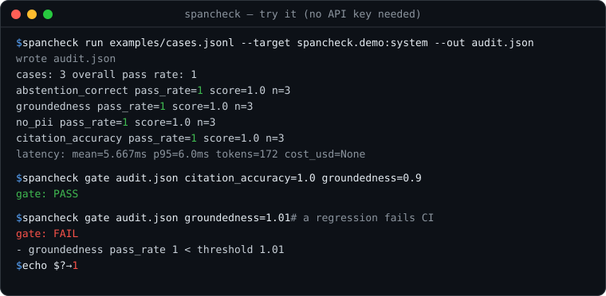

# spancheck

> © 2026 Trevor J. Romack — **MIT-licensed** ([LICENSE](LICENSE)) · `pip install spancheck` · tjromack@gmail.com

**Score a grounded-answer system on citation accuracy, abstention correctness, hallucination rate, cost and latency —
and get an audit log a compliance reviewer can read.**

`spancheck` is an installable, corpus-agnostic evaluation library for RAG and retrieval-then-answer pipelines. Point it
at any system through a thin adapter, give it a test set, and it produces a scorecard on the four metrics that decide
whether the system's answers can be trusted — plus a versioned audit log that reconstructs *why* each answer passed or
failed.

Library first, CLI second, GitHub Action third: the Python API is the product; the command line and the Action are thin
wrappers over it.



**Who it's for.** Teams shipping RAG or retrieval-then-answer systems — especially in regulated domains (healthcare,
finance, legal) — who need citation accuracy and abstention *instrumented* rather than asserted, want a regression gate
in CI, and need an audit trail a reviewer can read.

**How it compares.** General LLM-eval frameworks exist and cover broad quality scoring well — Ragas, DeepEval, TruLens,
promptfoo, Braintrust. `spancheck` is deliberately narrow: **citation-span verification** (is the cited span real, and
does it actually support the claim?) and **abstention correctness** as first-class, deterministic metrics, with a
versioned audit log built for regulated review. If you want a broad evaluation platform, reach for one of those; if the
two things you can't afford to get wrong are a fabricated citation and a failure to say "I don't know," that is the gap
this fills.

---

## The four metrics

| Metric | Question it answers | How it's scored |
|---|---|---|
| **Citation accuracy** | Does the cited span actually support the claim? | Deterministic span check *(the capability built first and tested deepest)* |
| **Abstention correctness** | Does it decline when the answer isn't in the corpus, and answer when it is? | Deterministic |
| **Hallucination rate** | What share of answers assert something the retrieved context doesn't support? | Deterministic groundedness + calibrated LLM-judge for the qualitative residue |
| **Cost & latency** | Tokens / dollars / wall-clock per answer, against a budget | Deterministic, from a cached run — no network |

## Status

**Complete and dogfooded.** The measurement core (`Case` / `evaluate` / `Run` / `Scorecard` / `diff` / `gate`), the thin
`adapter` contract, the deterministic graders, **citation-span verification** — the capability this build exists to
add — the **cost/latency + versioned audit log** layer, the **calibrated LLM-judge**, and the **CLI + GitHub Action**
are implemented, dependency-free (the judge reaches a model only through a caller-supplied callable), and tested
(68 tests, green on a clean `pip install` and in CI). Citation verification splits into **provenance** (is the cited
span really in the retrieved context, verbatim?) and **support** (does the span cover the claim?); both must hold, so a
fabricated quote or a right-answer-wrong-citation cannot pass. A captured run re-scores **offline** (`Run.rescore`), and
`run.audit_log()` emits a versioned, self-describing record with per-citation verdicts (schema in
[`docs/AUDIT-LOG.md`](docs/AUDIT-LOG.md)). The LLM-judge is **opt-in** — the default grader set stays deterministic and
offline — and is **calibrated before it is trusted**.

## Results (measured)

`spancheck` was run end-to-end against a real product pipeline as a black box (a grounded answer-a-document tool on
`claude-sonnet-5`, over its own sample contract), and the judge was calibrated against a human-labelled gold set. Full
write-up in [`docs/CASE-STUDY.md`](docs/CASE-STUDY.md); the audit log is committed at
[`dogfood/suver_audit.json`](dogfood/suver_audit.json).

| Metric | Result |
|---|---|
| Citation accuracy (real pipeline) | **1.00** — every cited span real and supporting |
| Hallucination (groundedness) | **0 hallucinations** (pass-rate 1.00) |
| Abstention correctness | 11/12 — spancheck **caught one false-abstention** on the real system |
| Overall (12 cases) | **0.967** |
| Judge vs human gold set — stub / `claude-sonnet-5` | **0.75 / 1.00** |
| Tests | **68**, clean `pip install` + CI (3.11 & 3.12) |

The one miss is the point: the eval found a real recall gap in a shipping system — a measured behaviour, not a spancheck
bug. Reproduce with `python dogfood/run_dogfood.py` and `python -m spancheck.calibrate --real`.

## Command line & CI

The CLI is a thin wrapper over the library. It works out of the box against a shipped demo target — no key, no user
code:

```bash
pip install spancheck          # or `pip install -e .` from a clone
spancheck run examples/cases.jsonl --target spancheck.demo:system --out audit.json
spancheck score audit.json                                    # recompute metrics from the cache, offline
spancheck gate  audit.json citation_accuracy=1.0 groundedness=0.9   # exit 1 on failure (for CI)
```

Point `--target` at your own system with `module:callable` (any `input -> answer` function; the answer may be a string
or a dict with `contexts`/`citations`/`usage`).

The deterministic path needs no key. The **opt-in LLM-judge** (`--real` calibration, or `judge_support(provider=...)`)
reads `ANTHROPIC_API_KEY` — set it in the environment, or drop it in a gitignored `.env` at the repo root
(`ANTHROPIC_API_KEY=sk-ant-...`), which the CLI and `spancheck.calibrate` load automatically.

As a **GitHub Action** (fails a PR on a regression):

```yaml
- uses: tjromack/spancheck@main
  with:
    cases: eval/cases.jsonl
    target: myapp.rag:answer
    thresholds: "citation_accuracy=1.0 groundedness=0.9"
    baseline: baseline-audit.json   # optional: also fail on a pass-rate drop
```

## Lineage

`spancheck` is the spinoff of [`llm-eval-guardrails-harness`](https://github.com/tjromack/llm-eval-guardrails-harness) —
the version that proved the method against a single real target (a regulatory RAG copilot), with LLM-judge agreement
1.00 against a human gold set. This package is the same method, extracted from an in-repo lab, generalised to any
corpus, and packaged so a stranger can install it and point it at their own system. What carried over unchanged, what
was rewritten and why, and what the harness got wrong that this fixes are recorded in [`LINEAGE.md`](LINEAGE.md).

## Quickstart

> The Phase-1 core below runs today (`pip install -e .`). Lines marked *(Phase 3)* / *(Phase 2)* are the intended shape
> of what those phases add; see `Status` and `TODO.md`.

```python
from spancheck import Case, evaluate, adapter, citation_accuracy

# 1. Wrap your system in a thin adapter: input -> {answer, contexts, citations, usage, latency_ms}
#    (optional — evaluate() also accepts a plain input->answer callable and times it for you)
my_system = adapter(lambda q: my_rag_pipeline(q))

# 2. Describe your test set — answerable, unanswerable, and adversarial cases
cases = [
    Case(id="q1", input="What is the notice period?", category="answerable",
         expected="30 days", meta={"answerable": True}),
    Case(id="q2", input="What is the company's revenue?", category="unanswerable",
         meta={"answerable": False}),  # should abstain
]

# 3. Score it — a run is captured once, then the metrics compute offline
run = evaluate(cases, my_system)
print(run.scorecard().by_grader())   # citation accuracy, abstention correctness, groundedness, PII-leak
run.save("run.json")                 # persist a run for baselines / regression gating
run.audit_log("audit.json")          # the versioned, compliance-readable record (per-citation verdicts + cost/latency)
run.rescore([citation_accuracy(support_threshold=0.8)])  # re-score the SAME run offline — no system call
```

```bash
# CLI (thin wrapper over the same API) — command surface exists; wired to the library in Phase 5
spancheck run cases.jsonl --target my_module:my_system --out audit.json
spancheck score audit.json        # recompute metrics from a cached run, no network
```

## Limits — what a passing score does *not* claim

- **Deterministic support is a lexical proxy, not entailment.** By default, citation *support* is scored by how much of
  the claim's wording the cited span covers — fast, offline, and unable to see a span that shares the claim's words but
  **contradicts** it ("the notice period is *not* 30 days"). The **opt-in LLM-judge** upgrades this to true entailment
  (`citation_accuracy(support_fn=judge_support(provider=...))`), and is **calibrated against a human gold set before it
  is trusted** (`python -m spancheck.calibrate`). The deterministic core flags the proxy's boundary rather than hiding
  it (a test pins the false-positive; the judge catches it).
- **Provenance requires a verbatim quote.** A paraphrased citation fails provenance by design — a deliberate incentive
  for a system to quote its sources exactly. `spancheck` does not (yet) match a citation by meaning.
- **A citation isn't scoped to its named source.** A cited span found in *any* retrieved context passes; tying a
  citation to the specific `source_id` it names is a planned refinement.
- **Groundedness is a word-overlap proxy too**, and the metrics are only as good as the test set you bring. `spancheck`
  measures a system against cases you author; it does not generate them.
- **Not a general-purpose eval platform, and not a benchmark.** It scores the four trust metrics above on *your* corpus;
  broad quality evaluation is what the frameworks in "How it compares" are for, and benchmark-grade methodology
  (labeling rigour, inter-rater agreement, public leaderboard) is a separate effort.

## Design pins

- **Library-first, CLI-second** — the API is the product.
- **No provider lock-in** — a thin adapter from day one; stub by default, any model behind a callable.
- **Every metric computable without network given a cached run** — capture once, re-score offline.
- **The audit-log schema is versioned** — a breaking change is a major version bump; it's a contract with a reviewer.
- **Judge prompts live in version-controlled files** — a rubric change is a reviewable, version-stamped diff.
- **No dependency on any other project's internals** — standalone; dogfooded as a black box, never coupled.

## License

**MIT** — see [LICENSE](LICENSE). Free to use, modify, and distribute; the library is a tool meant to be run against
your own systems.
